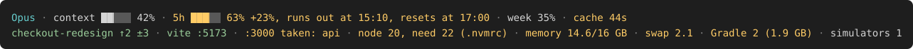

# promptsill

A status line for [Claude Code](https://code.claude.com) that knows about your dev machine, not just your session.



```text
Opus · context ██▏   42% · 5h ███▏  63% +23%, runs out at 15:10, resets at 17:00 · week 35% · cache 44s
checkout-redesign ↑2 ±3 · vite :5173 · :3000 taken: api · node 20, need 22 (.nvmrc) · memory 14.6/16 GB · Gradle 2 (1.9 GB)
```

## What it shows that others don't

The second line is about the project you're in and the machine it runs on. Each part appears only when it has something to say:

- **Your dev servers.** `vite :5173` when this project's server is running, clickable to open it in the browser.
- **Busy ports.** `:3000 taken: api` when the port your project needs is held by another folder's server.
- **Node version.** `node 20, need 22 (.nvmrc)` when the active `node` doesn't match `.nvmrc`, `.node-version` or `engines`.
- **Memory pressure** on macOS. Used memory and swap, yellow or red when free memory runs low or swap grows.
- **Gradle and Kotlin daemons** with the RAM they hold, in JVM and Android projects or whenever memory is tight.
- **iOS simulators and the Android emulator** in mobile projects, so you notice the ones you forgot to close.
- **A huge session file**, from 50 MB up.

## The Claude part

- **Context** as a bar with 1/8-cell precision.
- **Limit pace.** For the 5-hour and weekly limits, promptsill compares how much you've used with how much of the window has passed. 60% in the first hour of five is a problem; 60% in the last hour is fine. Colors follow the pace, not the raw percentage. `+23%` means you're 23 points ahead of an even pace, and `runs out at 15:10` says when you'll hit the limit if you keep going like this.
- **Prompt cache timer.** `cache 44s` shortly before the cache expires, and `cache expired` after it has. The next message after expiry re-reads the whole conversation, which costs more of your limit.
- **Git branch** with commits ahead and behind, `not pushed` and the number of changed files. It's clickable: it opens the pull request when one is open, otherwise the branch page.

When the terminal is narrow, promptsill shortens the parts first, then drops the least important ones. The limits, context and branch stay.

## Install

### Homebrew (macOS, Linux)

```bash
brew install kopylovis/tap/promptsill
promptsill install
```

### Claude Code plugin

```text
/plugin marketplace add kopylovis/promptsill
/plugin install promptsill@promptsill
/promptsill:setup
```

The plugin keeps its copy of promptsill up to date on every session start. Run `/promptsill:setup uninstall` before you uninstall the plugin.

### By hand

```bash
curl -fsSL https://raw.githubusercontent.com/kopylovis/promptsill/main/promptsill -o ~/.local/bin/promptsill
chmod +x ~/.local/bin/promptsill
promptsill install
```

promptsill is a single Python file with no dependencies. It needs `python3` 3.9 or newer, and uses `git`, `lsof` and `ps` when they're available. The cache timer needs Claude Code 2.1.251 or newer; everything else works with older versions.

## Commands

```text
promptsill install [--force] [--lang en|ru]   add the statusLine to ~/.claude/settings.json
promptsill uninstall                          remove it, and bring back the one it replaced
promptsill preview [--lang en|ru] [--width N] render sample data for the current folder
promptsill --version
```

`install` never replaces another status line unless you pass `--force`. When you do, the old one is saved and `uninstall` restores it. Before every change, `settings.json` is copied to `settings.json.promptsill-backup`. `CLAUDE_CONFIG_DIR` is respected.

## Settings

Labels are in English by default, and in Russian when your locale (`LC_ALL`, `LC_MESSAGES` or `LANG`) is Russian. To choose explicitly, use `install --lang ru`, the `PROMPTSILL_LANG` environment variable, or the config file.

Optional `~/.config/promptsill/config.json`:

```json
{
  "lang": "en",
  "links": true,
  "color": true,
  "ascii": false
}
```

- `links`: clickable branch and dev server links ([OSC 8](https://gist.github.com/egmontkob/eb114294efbcd5adb1944c9f3cb5feda); iTerm2, Kitty, WezTerm, Ghostty and others).
- `color`: `false` turns colors off; so does the `NO_COLOR` environment variable.
- `ascii`: `[##---]` bars for fonts without block characters; also `PROMPTSILL_ASCII=1`.

## Privacy

promptsill runs locally and makes no network requests. It reads the JSON Claude Code sends it, runs `git status`, `lsof` and `ps`, and keeps a few seconds of cache in `~/.cache/promptsill`.

## Development

```bash
make test               # unit tests and smoke checks
./promptsill preview    # see the line for the current folder
python3 docs/preview.py # regenerate the pictures in docs/
```

## License

[MIT](LICENSE)
